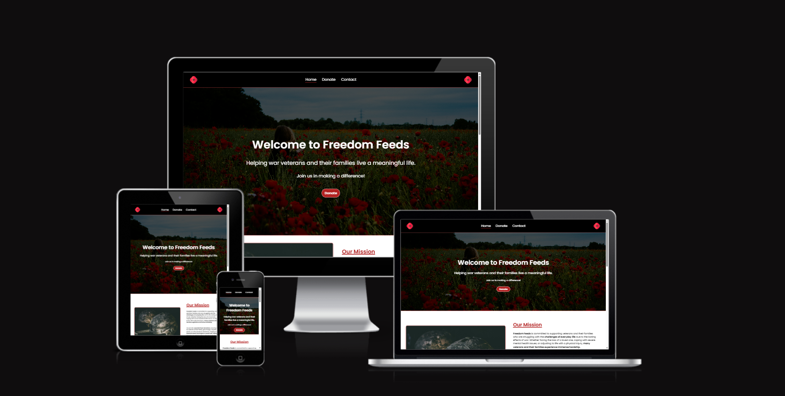
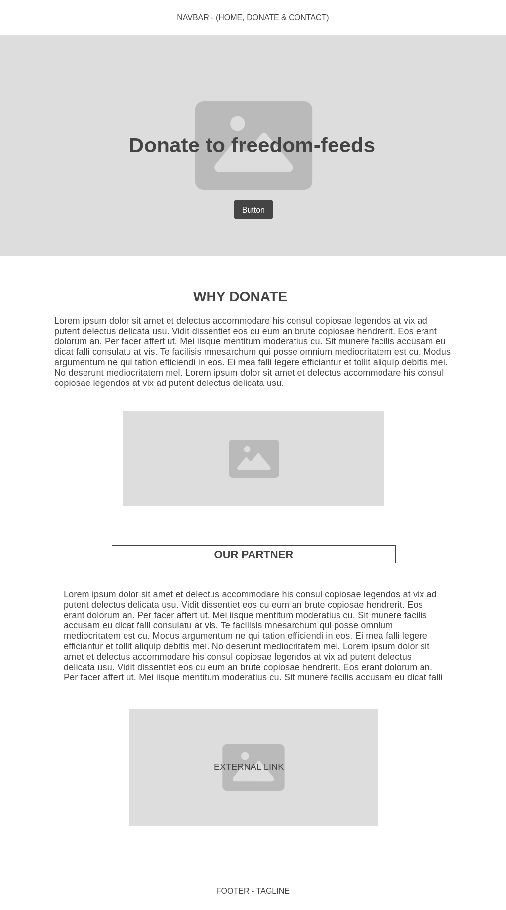
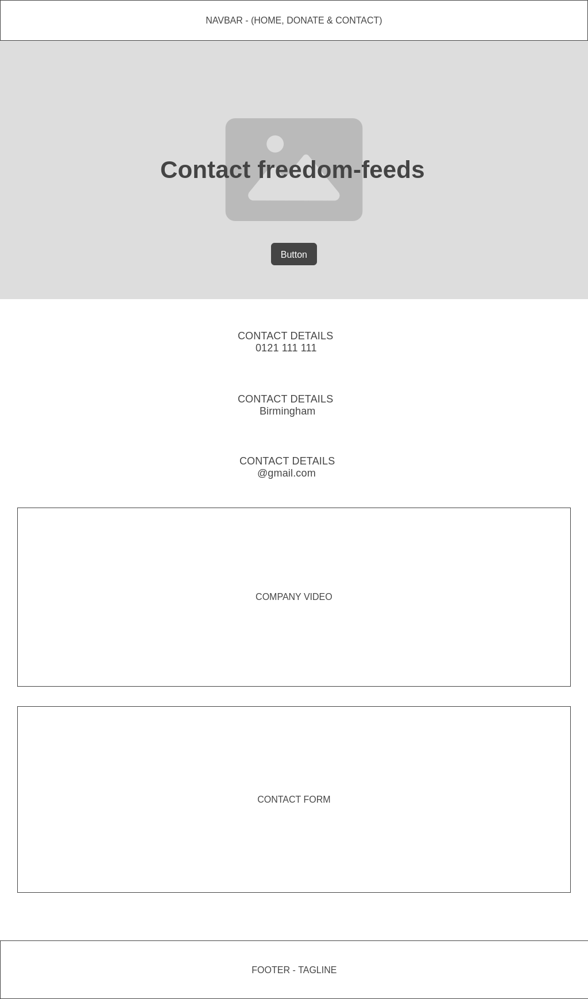
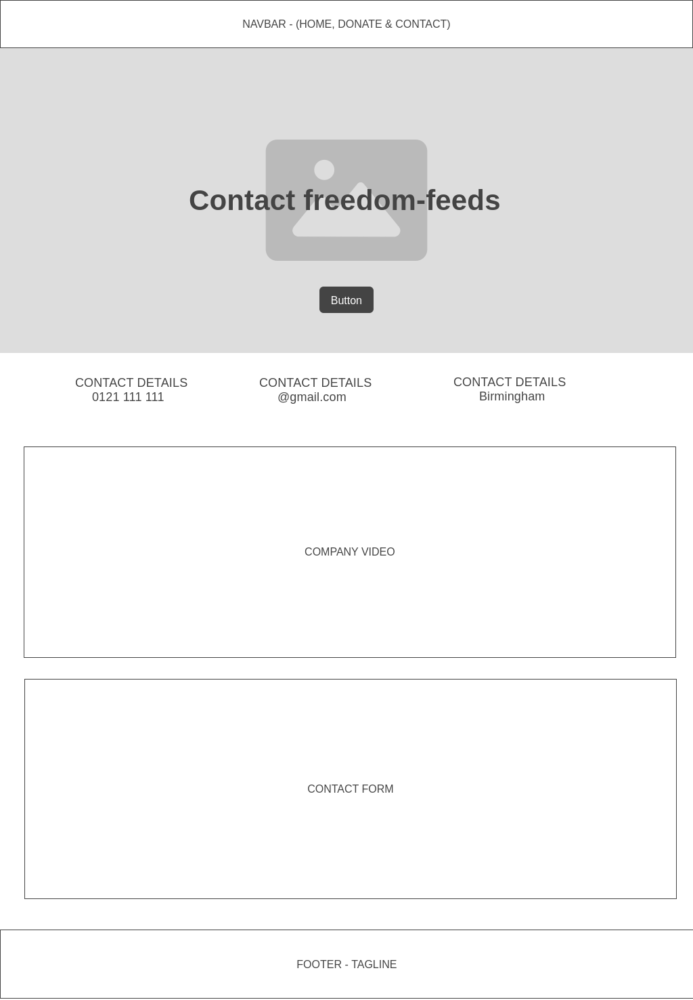
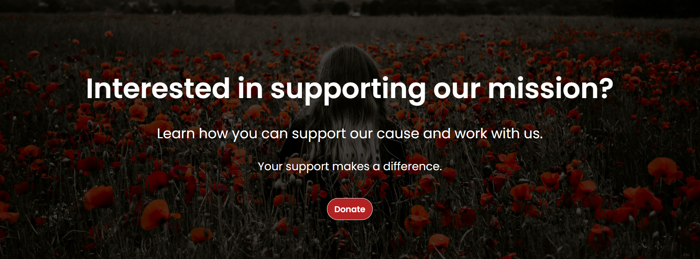
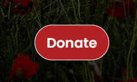
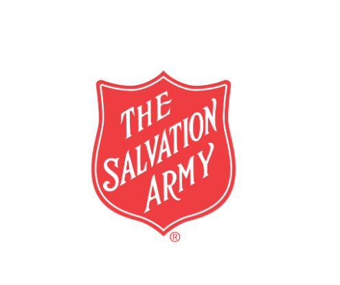

# [freedom-feeds-unit-1](https://jsgreen1129.github.io/freedom-feeds-unit-1)

Developer: Josh Green ([JSGREEN1129](https://www.github.com/JSGREEN1129))

Freedom-feeds is a charity that engages in fundraising activites to help support war veterans and their families, when they suffer hardship due to military deployment. This can be in the form of members of the public and corporate companies donating food, everyday essentials and technology grants. The freedom-feeds website will give users information on the charity itself, details on how users can contribute and donate to support the charity, contact details for the charity and information on how donations are used.

**Site Mockups**

source: [freedom-feeds-unit-1 amiresponsive](https://ui.dev/amiresponsive?url=https://jsgreen1129.github.io/freedom-feeds-unit-1)

## UX

### The 5 Planes of UX

#### 1. Strategy

**Purpose**
- Encourage users to donate to freedom-feeds by showcasing their mission, community and how donations are used.
- Provide a seamless user experience to keep users informed.

**Primary User Needs**
- Learn about the charity’s purpose and reasons.
- Learn how to donate to the charity.
- Access responsive and informative content.

**Business Goals**
- Increase donations.
- Boost awareness and create a recurring revenue.

#### 2. Scope

**[Features](#features)** (see below)

**Content Requirements**
- Clear, motivational text about the charities mission.
- Article of a war veterans family and their struggles.
- Contact form.
- External link to the salvation army.

#### 3. Structure

**Information Architecture**
- **Navigation Menu**:
  - Accessible links in the navbar.
- **Hierarchy**:
  - Clear call-to-action buttons.
  - Clear contact details.

**User Flow**
1. User lands on the home page → learns about the charity's mission and the people they help.
2. Navigates to the donate page → sees how they can donate.
3. Donate through one off donation or 12-month donation subscription.

#### 4. Skeleton

**[Wireframes](#wireframes)** (see below)

#### 5. Surface

**Visual Design Elements**
- **[Colours](#colour-scheme)** (see below)
- **[Typography](#typography)** (see below)

### Colour Scheme

- `#000000` Site background.
- `#FFFFFF` primary text.
- `#B22222` secondary text.

### Typography

    font-family: 'Poppins', sans-serif;
- [Poppins] (https://fonts.googleapis.com/css2?family=Poppins:wght@400;600&display=swap)
- [sans-serif]
- [Flaticon] (https://www.flaticon.com/free-icons/poppy) icons were used throughout the site in navbar and the footer.

## Wireframes

Wireframes were developed for mobile and desktop sizes.
I've used [Wireframe](https://wireframe.cc/) to design my site wireframes.

| Page | Mobile | Desktop |
| --- | --- | --- |
| Home |  |  |
| Donate |  |  |
| Contact |  |  |

## User Stories

| Target | Expectation | Outcome |
| --- | --- | --- |
| As a user | I would like to see reasons why I should donate to freedom-feeds | so that I can learn about the charity's mission and purpose before deciding to donate. |
| As a user | I would like to view information on how my donations would support war veterans and their families | so that I can decide whether to donate. |
| As a user | I would like to find the contact details for the charity | so that I can communicate and offer to volunteer my time. |
| As a user | I would like the website to be fully responsive | so that I can easily navigate and access information from my phone, tablet, or desktop. |

## Features

### Existing Features

| Feature | Notes | Screenshot |
| --- | --- | --- |
| Navbar | Featured on all three pages, the full responsive navigation bar includes links to the Home page, Doante page and Contact page, and is identical in each page to allow for easy navigation. On the smallest screens, there are no poppy icons. This section will allow the user to easily navigate from page to page across all devices without having to revert back to the previous page via the "back" button. |  | Hero Image | All pages include a photo with text-overlay. |  |

| Sophies Story | A personalised story form the wife of a war veteran whos husband suffered extreme mental health difficulties when returning from deployment. |  |

| CTA Button | A purpose built CTA button which can be positioned throughout the website to guide visitors to the donations page. |  |

| Salvation Army external link | An external link which opens the salvation army website in a new tab by clicking the logo. |  |

| Contact form | An easy to navigate contact form and submit button for users to contact through the web. |  |

| Footer | The footer includes links to the relevant social media sites for *Love Running*. The links will open in a new tab to allow easy navigation for the user. The footer is valuable to the user, as it encourages them to keep connected via social media. |  |

### Future Features

⚠️ INSTRUCTIONS ⚠️

Do you have additional ideas that you'd like to include on your project in the future? Fantastic, list them here! It's always great to have plans for future improvements. Consider adding any helpful links or notes to help remind you in the future, if you revisit the project in a couple years.

A few examples are listed below to align with possible ways to improve on the sample walkthrough project, to give you some inspiration.

⚠️ --- END ---⚠️

- **Personalized User Profiles**: Allow users to create accounts where they can track their running progress, view personal stats, and share their achievements.
- **Training Plans**: Offer customizable training plans for runners of all levels (beginner, intermediate, advanced) with notifications and reminders.
- **Event Registration & Payment**: Integrate an option for runners to register and pay for upcoming events or races directly through the site.
- **Achievements & Badges**: Introduce a gamification system where users earn badges or achievements for reaching milestones (e.g., number of runs, personal bests, attending events).
- **Interactive Maps**: Display interactive running route maps, complete with distance markers, elevation data, and difficulty ratings.
- **Live Event Tracking**: Provide real-time tracking for major club events so users can follow along or support friends running in real-time.
- **Runner's Blog**: Include a blog section for members to share their running experiences, tips, and stories, fostering community engagement.
- **Leaderboards**: Add a feature where users can compare their running stats with others in the club via leaderboards (e.g., most kilometers run, fastest times).
- **Weekly Challenges**: Implement weekly running challenges or group challenges to keep users motivated and engaged.
- **Weather Integration**: Show local weather conditions for Dublin and suggest the best times for a run, based on user preferences.
- **Social Sharing**: Enable users to share their runs, achievements, or event participation directly on social media from the site.
- **Club Merchandise Store**: Introduce an online store where users can purchase branded running gear like shirts, jackets, or water bottles.
- **Push Notifications**: Allow users to opt-in for mobile push notifications for schedule updates, new events, or motivational reminders.
- **Virtual Runs**: Create a platform for virtual runs where members can participate remotely and still receive medals or rewards.
- **Member Forums or Groups**: Introduce discussion boards or group chats for runners to connect, discuss upcoming events, or share training tips.
- **Charity Partnerships**: Offer integration with local charities where club members can run to raise money or awareness for specific causes.

## Tools & Technologies

| Tool / Tech | Use |
| --- | --- |
|  | Generate README and TESTING templates. |
|  | Version control. (`git add`, `git commit`, `git push`) |
|  | Secure online code storage. |
|  | Local IDE for development. |
|  | Main site content and layout. |
|  | Design and layout. |
|  | Hosting the deployed front-end site. |
|  | Icons. |
|  | Help debug, troubleshoot, and explain things. |

⚠️ NOTE ⚠️

Want to add more?

- Tutorial: https://shields.io/badges/static-badge
- Icons/Logos: https://simpleicons.org
  - FYI: not all logos are available to use

🛑 --- END --- 🛑

## Agile Development Process

### GitHub Projects

⚠️ TIP ⚠️

Consider adding screenshots of your Projects Board(s), Issues (open and closed), and Milestone tasks.

⚠️ --- END ---⚠️

[GitHub Projects](https://www.github.com/JSGREEN1129/freedom-feeds-unit-1/projects) served as an Agile tool for this project. Through it, EPICs, User Stories, issues/bugs, and Milestone tasks were planned, then subsequently tracked on a regular basis using the Kanban project board.

### GitHub Issues

[GitHub Issues](https://www.github.com/JSGREEN1129/freedom-feeds-unit-1/issues) served as an another Agile tool. There, I managed my User Stories and Milestone tasks, and tracked any issues/bugs.

| Link | Screenshot |
| --- | --- |
|  |  |
|  |  |

### MoSCoW Prioritization

I've decomposed my Epics into User Stories for prioritizing and implementing them. Using this approach, I was able to apply "MoSCoW" prioritization and labels to my User Stories within the Issues tab.

- **Must Have**: guaranteed to be delivered - required to Pass the project (*max ~60% of stories*)
- **Should Have**: adds significant value, but not vital (*~20% of stories*)
- **Could Have**: has small impact if left out (*the rest ~20% of stories*)
- **Won't Have**: not a priority for this iteration - future features

## Testing

> [!NOTE]
> For all testing, please refer to the [TESTING.md](TESTING.md) file.

## Deployment

### GitHub Pages

The site was deployed to GitHub Pages. The steps to deploy are as follows:

- In the [GitHub repository](https://www.github.com/JSGREEN1129/freedom-feeds-unit-1), navigate to the "Settings" tab.
- In Settings, click on the "Pages" link from the menu on the left.
- From the "Build and deployment" section, click the drop-down called "Branch", and select the **main** branch, then click "Save".
- The page will be automatically refreshed with a detailed message display to indicate the successful deployment.
- Allow up to 5 minutes for the site to fully deploy.

The live link can be found on [GitHub Pages](https://jsgreen1129.github.io/freedom-feeds-unit-1).

### Local Development

This project can be cloned or forked in order to make a local copy on your own system.

#### Cloning

You can clone the repository by following these steps:

1. Go to the [GitHub repository](https://www.github.com/JSGREEN1129/freedom-feeds-unit-1).
2. Locate and click on the green "Code" button at the very top, above the commits and files.
3. Select whether you prefer to clone using "HTTPS", "SSH", or "GitHub CLI", and click the "copy" button to copy the URL to your clipboard.
4. Open "Git Bash" or "Terminal".
5. Change the current working directory to the location where you want the cloned directory.
6. In your IDE Terminal, type the following command to clone the repository:
	- `git clone https://www.github.com/JSGREEN1129/freedom-feeds-unit-1.git`
7. Press "Enter" to create your local clone.

Alternatively, if using Gitpod, you can click below to create your own workspace using this repository.

**Please Note**: in order to directly open the project in Gitpod, you should have the browser extension installed. A tutorial on how to do that can be found [here](https://www.gitpod.io/docs/configure/user-settings/browser-extension).

#### Forking

By forking the GitHub Repository, you make a copy of the original repository on our GitHub account to view and/or make changes without affecting the original owner's repository. You can fork this repository by using the following steps:

1. Log in to GitHub and locate the [GitHub Repository](https://www.github.com/JSGREEN1129/freedom-feeds-unit-1).
2. At the top of the Repository, just below the "Settings" button on the menu, locate and click the "Fork" Button.
3. Once clicked, you should now have a copy of the original repository in your own GitHub account!

### Local VS Deployment

⚠️ INSTRUCTIONS ⚠️

Use this space to discuss any differences between the local version you've developed, and the live deployment site. Generally, there shouldn't be [m]any major differences, so if you honestly cannot find any differences, feel free to use the following example:

⚠️ --- END --- ⚠️

There are no remaining major differences between the local version when compared to the deployed version online.

## Credits

⚠️ INSTRUCTIONS ⚠️

In the following sections, you need to reference where you got your content, media, and any extra help. It is common practice to use code from other repositories and tutorials (which is totally acceptable), however, it is important to be very specific about these sources to avoid potential plagiarism.

⚠️ --- END ---⚠️

### Content

⚠️ INSTRUCTIONS ⚠️

Use this space to provide attribution links for any borrowed code snippets, elements, and resources. Ideally, you should provide an actual link to every resource used, not just a generic link to the main site. If you've used multiple components from the same source (such as Bootstrap), then you only need to list it once, but if it's multiple Codepen samples, then you should list each example individually. If you've used AI for some assistance (such as ChatGPT or Perplexity), be sure to mention that as well. A few examples have been provided below to give you some ideas.

⚠️ --- END ---⚠️

| Source | Notes |
| --- | --- |
| [Markdown Builder](https://markdown.2bn.dev) | Help generating Markdown files |
| [Chris Beams](https://chris.beams.io/posts/git-commit) | "How to Write a Git Commit Message" |
| [Rosie Resumé](https://codeinstitute.net) | Code Institute walkthrough project inspiration |
| [Bootstrap](https://getbootstrap.com) | Various components / responsive front-end framework |
| [ChatGPT](https://chatgpt.com) | Help with code logic and explanations |

### Media

⚠️ INSTRUCTIONS ⚠️

Use this space to provide attribution links to any media files borrowed from elsewhere (images, videos, audio, etc.). If you're the owner (or a close acquaintance) of some/all media files, then make sure to specify this information. Let the assessors know that you have explicit rights to use the media files within your project. Ideally, you should provide an actual link to every media file used, not just a generic link to the main site, unless it's AI-generated artwork.

Looking for some media files? Here are some popular sites to use. The list of examples below is by no means exhaustive. Within the Code Institute Slack community, you can find more "free media" links by sending yourself (or Slackbot) the following command: `!freemedia`.

- Images
    - [Pexels](https://www.pexels.com)
    - [Unsplash](https://unsplash.com)
    - [Pixabay](https://pixabay.com)
    - [Lorem Picsum](https://picsum.photos) (placeholder images)
    - [Wallhere](https://wallhere.com) (wallpaper / backgrounds)
    - [This Person Does Not Exist](https://thispersondoesnotexist.com) (reload to get a new person)
- Audio
    - [Audio Micro](https://www.audiomicro.com/free-sound-effects)
- Video
    - [Videvo](https://www.videvo.net)
- Image Compression
    - [TinyPNG](https://tinypng.com) (for images <5MB)
    - [CompressPNG](https://compresspng.com) (for images >5MB)

A few examples have been provided below to give you some ideas on how to do your own Media credits.

⚠️ --- END ---⚠️

| Source | Notes |
| --- | --- |
| [favicon.io](https://favicon.io) | Generating the favicon |
| [Rosie CV](https://codeinstitute.net) | Sample images provided from the walkthrough projects |
| [Font Awesome](https://fontawesome.com) | Icons used throughout the site |
| [Pexels](https://images.pexels.com/photos/416160/pexels-photo-416160.jpeg) | Hero image |
| [Wallhere](https://c.wallhere.com/images/9c/c8/da4b4009f070c8e1dfee43d25f99-2318808.jpg!d) | Background wallpaper |
| [Pixabay](https://cdn.pixabay.com/photo/2017/09/04/16/58/passport-2714675_1280.jpg) | Background wallpaper |
| [DALL-E 3](https://openai.com/index/dall-e-3) | AI generated artwork |
| [TinyPNG](https://tinypng.com) | Compressing images < 5MB |
| [CompressPNG](https://compresspng.com) | Compressing images > 5MB |
| [CloudConvert](https://cloudconvert.com/webp-converter) | Converting images to `.webp` |

### Acknowledgements

⚠️ INSTRUCTIONS ⚠️

Use this space to provide attribution and acknowledgement to any supports that helped, encouraged, or supported you throughout the development stages of this project. It's always lovely to appreciate those that help us grow and improve our developer skills. A few examples have been provided below to give you some ideas.

⚠️ --- END ---⚠️

- I would like to thank my Code Institute mentor, [Tim Nelson](https://www.github.com/TravelTimN) for the support throughout the development of this project.
- I would like to thank the [Code Institute](https://codeinstitute.net) Tutor Team for their assistance with troubleshooting and debugging some project issues.
- I would like to thank the [Code Institute Slack community](https://code-institute-room.slack.com) for the moral support; it kept me going during periods of self doubt and impostor syndrome.
- I would like to thank my partner, for believing in me, and allowing me to make this transition into software development.
- I would like to thank my employer, for supporting me in my career development change towards becoming a software developer.

