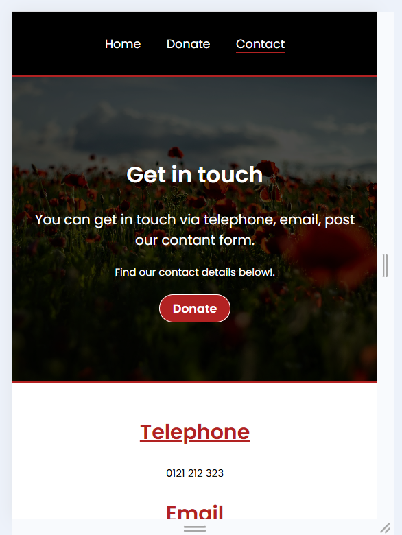
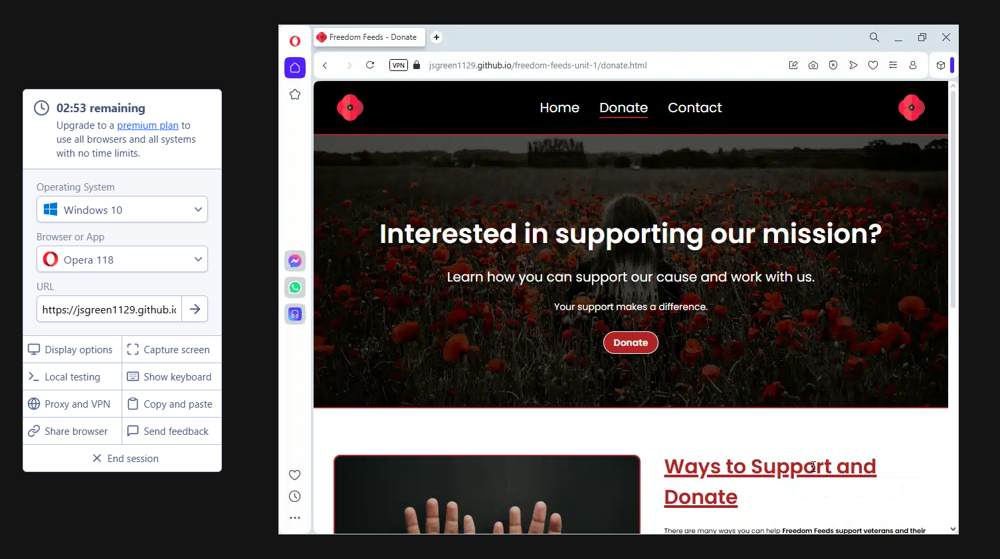

# Testing

> [!NOTE]
> Return back to the [README.md](README.md) file.

## Code Validation

### HTML

I have used the recommended [HTML W3C Validator](https://validator.w3.org) to validate all of my HTML files.

| Directory | File | URL | Screenshot |
| --- | --- | --- | --- |
|  | [contact-us.html](https://github.com/JSGREEN1129/freedom-feeds-unit-1/blob/main/contact-us.html) | [HTML Validator](https://validator.w3.org/nu/?doc=https://jsgreen1129.github.io/freedom-feeds-unit-1/contact-us.html) |  |
|  | [donate.html](https://github.com/JSGREEN1129/freedom-feeds-unit-1/blob/main/donate.html) | [HTML Validator](https://validator.w3.org/nu/?doc=https://jsgreen1129.github.io/freedom-feeds-unit-1/donate.html) |  |
|  | [index.html](https://github.com/JSGREEN1129/freedom-feeds-unit-1/blob/main/index.html) | [HTML Validator](https://validator.w3.org/nu/?doc=https://jsgreen1129.github.io/freedom-feeds-unit-1/index.html) |  |

### CSS

I have used the recommended [CSS Jigsaw Validator](https://jigsaw.w3.org/css-validator) to validate all of my CSS files.

| Directory | File | URL | Screenshot |
| --- | --- | --- | --- |
| assets | [stylesheet.css](https://github.com/JSGREEN1129/freedom-feeds-unit-1/blob/main/assets/stylesheet/stylesheet.css) | [CSS Validator](https://jigsaw.w3.org/css-validator/validator?uri=https://jsgreen1129.github.io/freedom-feeds-unit-1) |  |

## Responsiveness

I've tested my deployed project to check for responsiveness issues.

| Page | Mobile | Tablet | Desktop |
| --- | --- | --- | --- |
| Home |  |  |  |
| Donate |  |  |  |
| Contact-us |  |  |  |

## Browser Compatibility

I've tested my deployed project on multiple browsers to check for compatibility issues.

| Page | Chrome | Firefox | Opera |
| --- | --- | --- | --- |
| Home |  |  |  |
| Donate |  |  |  |
| Contact-us |  |  |  |

## Lighthouse Audit

I've tested my deployed project using the Lighthouse Audit tool to check for any major issues. Some warnings are outside of my control, and mobile results tend to be lower than desktop.

| Page | Desktop |
| --- | --- |
| Home |  |
| Donate |  |
| Contact-us |  |

> [!IMPORTANT]
> There are no remaining bugs that I am aware of, though, even after thorough testing, I cannot rule out the possibility.

